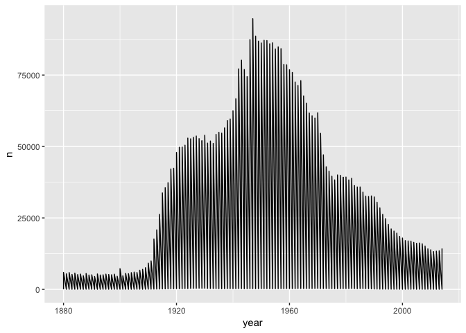
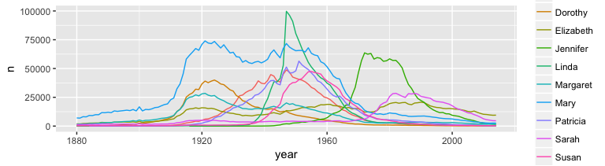

Babynames Exercise
------------------

-   For each year from 1880 to 2013, the data contains the number of children of each sex given each name. All names with more than 5 uses are given. (Source: <http://www.ssa.gov/oact/babynames/limits.html>)


Install data package
--------------------

We are using the package "babynames" to get familiar with time series plots.

``` r
library(babynames)
```

And while we are at it, let's load a few more necessary and helpful packages.

``` r
library(ggplot2)    # the king of plotting 
library(magrittr)   # chain operators, e.g. to "pipe" a value forward
library(dplyr)      # for data manipulation 
```

Let's check the data
--------------------

``` r
str(babynames)
```

    ## Classes 'tbl_df', 'tbl' and 'data.frame':    1825433 obs. of  5 variables:
    ##  $ year: num  1880 1880 1880 1880 1880 1880 1880 1880 1880 1880 ...
    ##  $ sex : chr  "F" "F" "F" "F" ...
    ##  $ name: chr  "Mary" "Anna" "Emma" "Elizabeth" ...
    ##  $ n   : int  7065 2604 2003 1939 1746 1578 1472 1414 1320 1288 ...
    ##  $ prop: num  0.0724 0.0267 0.0205 0.0199 0.0179 ...

From A...
---------

``` r
head(babynames)
```

    ## # A tibble: 6 × 5
    ##    year   sex      name     n       prop
    ##   <dbl> <chr>     <chr> <int>      <dbl>
    ## 1  1880     F      Mary  7065 0.07238359
    ## 2  1880     F      Anna  2604 0.02667896
    ## 3  1880     F      Emma  2003 0.02052149
    ## 4  1880     F Elizabeth  1939 0.01986579
    ## 5  1880     F    Minnie  1746 0.01788843
    ## 6  1880     F  Margaret  1578 0.01616720

to ... Z
--------

``` r
tail(babynames)
```

    ## # A tibble: 6 × 5
    ##    year   sex    name     n         prop
    ##   <dbl> <chr>   <chr> <int>        <dbl>
    ## 1  2014     M    Zyel     5 2.463303e-06
    ## 2  2014     M  Zykeem     5 2.463303e-06
    ## 3  2014     M  Zymeer     5 2.463303e-06
    ## 4  2014     M Zymiere     5 2.463303e-06
    ## 5  2014     M   Zyran     5 2.463303e-06
    ## 6  2014     M   Zyrin     5 2.463303e-06

How many names?
---------------

``` r
# How many unique names?
length(unique(babynames$name))
```

    ## [1] 93889

``` r
# How many kids in database (note n>5 per name/year)
sum(babynames$n)/10^6
```

    ## [1] 337.1354

Plot a single name over time - Choose yours!
--------------------------------------------

``` r
ggplot(babynames, aes(year, n)) +
  geom_line(data = filter(babynames, name=="James"))
```



Want went wrong here?

Check the data again
--------------------

``` r
head(filter(babynames, name=="James"))
```

    ## # A tibble: 6 × 5
    ##    year   sex  name     n         prop
    ##   <dbl> <chr> <chr> <int>        <dbl>
    ## 1  1880     F James    22 0.0002253983
    ## 2  1880     M James  5927 0.0500591216
    ## 3  1881     F James    24 0.0002427774
    ## 4  1881     M James  5442 0.0502567323
    ## 5  1882     F James    18 0.0001555775
    ## 6  1882     M James  5892 0.0482820221

``` r
  # -> There are female and male entries for some names.
```

Plot a single name over time
----------------------------

``` r
ggplot(babynames, aes(year, n)) +
  geom_line(data = filter(babynames, name=="James"), aes(color=sex))
```


Top 10 Names of all time
------------------------

``` r
library{magrittr}  # this is for the chain operator %>%
```

-   We select the top 10 boys and girls names of all time from the overall dataset

``` r
# Try to follow this code chunk at home, using dplyr() and magrittr()
top10 <- babynames %>%
  group_by(sex, name) %>%
  summarize(total = sum(n)) %>%
  arrange(desc(total)) %>%
  group_by(sex) %>%
  mutate(rank=row_number()) %>%
  filter(rank<=10)  %>%
  arrange(sex, rank)

top10f <- top10 %>% filter(sex=="F")
top10m <- top10 %>% filter(sex=="M")
```

Top 10 Names of all time - for girls
------------------------------------

    ## Source: local data frame [10 x 4]
    ## Groups: sex [1]
    ## 
    ##      sex      name   total  rank
    ##    <chr>     <chr>   <int> <int>
    ## 1      F      Mary 4115282     1
    ## 2      F Elizabeth 1601128     2
    ## 3      F  Patricia 1570567     3
    ## 4      F  Jennifer 1462742     4
    ## 5      F     Linda 1450843     5
    ## 6      F   Barbara 1432944     6
    ## 7      F  Margaret 1240006     7
    ## 8      F     Susan 1120469     8
    ## 9      F   Dorothy 1105680     9
    ## 10     F     Sarah 1060643    10

Top 10 Names of all time - and boys
-----------------------------------

    ## Source: local data frame [10 x 4]
    ## Groups: sex [1]
    ## 
    ##      sex    name   total  rank
    ##    <chr>   <chr>   <int> <int>
    ## 1      M   James 5105919     1
    ## 2      M    John 5084943     2
    ## 3      M  Robert 4796695     3
    ## 4      M Michael 4309198     4
    ## 5      M William 4055473     5
    ## 6      M   David 3577704     6
    ## 7      M  Joseph 2570095     7
    ## 8      M Richard 2555330     8
    ## 9      M Charles 2364332     9
    ## 10     M  Thomas 2283080    10

Plot most 10 common names for boys and girls
--------------------------------------------

``` r
babynames %>%
  filter(sex=="F") %>%
  filter(name %in% top10f$name) %>%
  ggplot(., aes(year, n)) +
  geom_line(aes(color=name, group=name))

babynames %>%
  filter(sex=="M") %>%
  filter(name %in% top10m$name) %>%
  ggplot(., aes(year, n)) +
  geom_line(aes(color=name, group=name))
```

Plot 10 most common names
-------------------------




Continue the exercise at home
-----------------------------

-   Plot the most common names in 2013 over the entire period.
-   Explore which names are most often used as unisex names. For which names has the popularity over time changed a lot?
